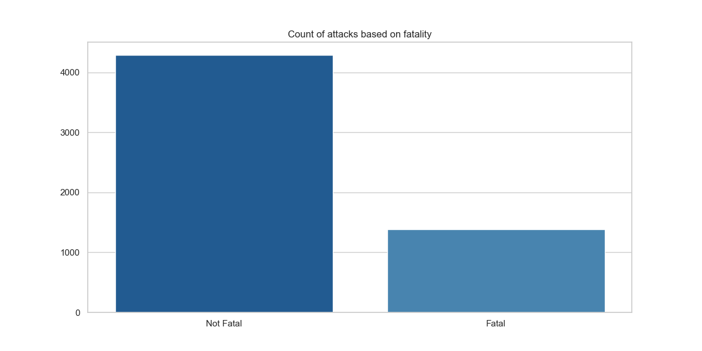
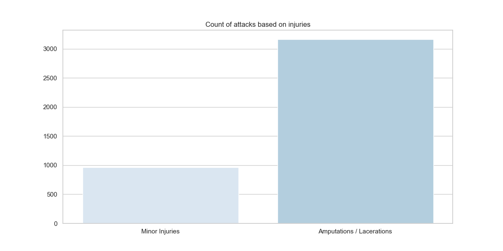
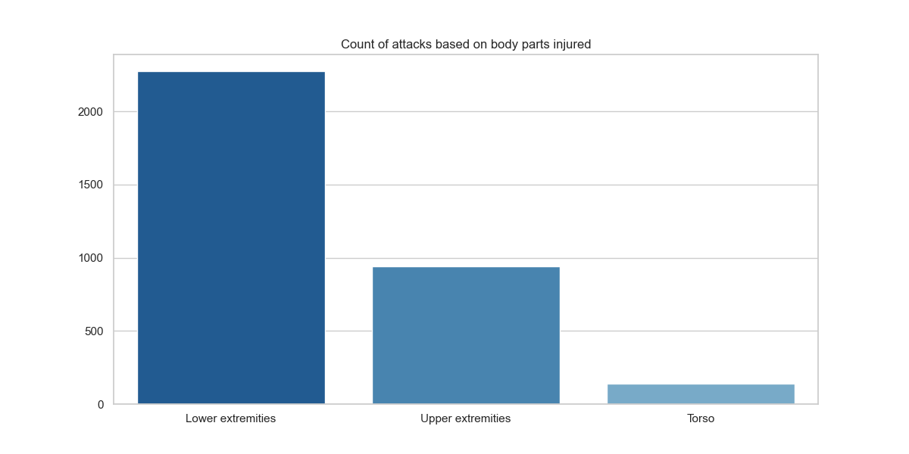
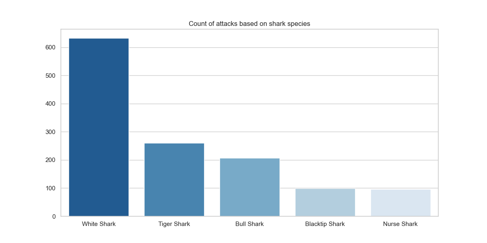
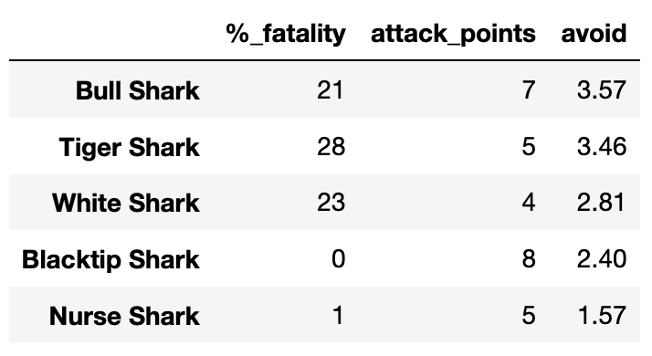

# SHARK ATTACK
**ironhack_project-1**

We are analyzing a dataset that registers shark attacks over time.

The objective of this exercise is to practice data cleaning and transformations to extract insights from the data.

Since the data has not been sampled procedurally, I will focus first on cleaning and transforming the data before analyzing the values that might be interesting for the matter.

I will try to answer the question we all consider when thinking about being attacked by a shark: What should we expect?

Firstly, we will use the attributes of the DataFrame class to conduct an initial analysis of the data. Some of the attributes consulted include 

`df.shape`, `df.info`, `df.columns`.

Once we have a general overview of the state of the dataset and the values it contains, we move on to a more detailed analysis.

First, we will analyze those values that can be discarded or omitted from the study, either because they are duplicate, empty, or irrelevant for the specific analysis.

## Phase 1: Managing Duplicated, Missing, or Irrelevant Data 

### Duplicate values:

First of all, I analyze duplicate values. With the `drop_duplicates()` method, we can eliminate all entries that are duplicated in our dataset.

Next, I analyze columns. I have created a function that compares the values of one column against those of another. After executing the function, in several pairs of columns that seem similar in their values, we observe that:

 - Columns "case_number.1" and "case_number" are 99% equal.
 - Columns "case_number.2" and "case_number" are 99% equal.
 - Columns "case_number.2" and "case_number.1" are 99% equal.
 - As "case_number," "case_number.1," and "case_number.2" are 99% equal, I drop 2 of them, keeping "case_number."
 - Columns "href" and "href_formula" are 98% equal. We can drop one of them → drop href_formula.

Data in "href" contains a link where a PDF document is stored on the internet. We extract the file name with a regex pattern to evaluate if it is the same information that we have in the column "pdf." Comparing the "href_pdf" file name and the "pdf" column, we see that "pdf" and "href_pdf" are 98% equal.

  - Information in "href" is the same as in "pdf" → drop href.
    

### Empty values:

Next, we are going to analyze columns/rows that contain a majority of NaN values. A column/row that is not sufficiently completed won't give us any relevant information:

  - "unnamed:_22" and "unnamed:_23" have just 1 and 2 non-null values.
  - "age" colum has almost 50% NaN values → not accurate data.
  - Drop rows to keep those with 80% completed values. Reduce data by 2%.

### Irrelevant data: 

Now we are going to exclude those columns that won't be significant for the purpose of our analysis:

  - "investigator_or_source"
  - "original order"
  - "name"
  - Values referring to time/dates: "case_number," "date," "year," "time," "pdf"
  - Values referring to location: "country," "area," "location"
    
He export the data set to save changes and continue with the analisis.

## Phase 2: Complex tranformations

The columns that contain the information necessary to answer the question posed. We move on to analyze and transform these data to obtain accurate values.

### Column "fatal_(y/n)":

Fatal should have binary data, as fata can take twoo values "Y"/"N". By appling value_counts we see that there is some values that don't meet this structure. 

For replacing the misleading values, he first fill all nan values with a string "empty". We tranform Nan values to string to avoid an ErrorType in the future. 

Then, by using `.str` we can apply the `.strip()` method and the `.upper()` method to format all values, and after i used the replace() method to replace values that werent "Y"/"N" to Nan also the ones that we set earlier to "empty".

### Column "sex":

With this column i took the same aproach as in fatal and did the same transformations, but in this case values were taking values "M"/"F"

### Column "activity", "species", "injuries":

Here's a corrected version of the text:

For these three columns, I've taken the same approach:

First, I use fillna() with the value "empty" to avoid TypeErrors in the future.

Then, I created a function called "texto_csv" that exports all values of the column to a .csv file.

Afterward, I applied another function that evaluates all words in the CSV file and returns the number of most repeated words in the file and how many times each word appears. This function uses the Counter() function from the "collections" module.

For better results, I also created a list of words to remove from the analysis when processing the CSV file. I took a list of common words that are usually excluded when analyzing text and personalized it by adding keywords that were frequently repeated in the column and that I wanted to exclude.

Once I had the most repeated words, I created a regex pattern to identify them and set them in a dictionary as the key-values, assigning each of them the value to which they will evaluate when meeting the regex pattern.

Then, I used the assign_group function that analyzes the values in the data frame and returns the category met. In case any category was met, it returned the variable passed as an argument, "Other."

Now that we have cleaned all the data, we can continue with the analysis. In this phase, we will create visualizations to interpret the data and draw conclusions. We won't consider columns "sex" and "type" for this analysis, so we can exclude them from the dataset.

## Phase 3: Visualization

### 1. Count of attacks based on fatality

I created a countplot to visualize how many incidents were labeled as "Fatal" and how many as "Not Fatal" to analyze the chances of dying from a shark attack.

As seen in the graphic, in most cases, the attack does not result in fatality.

### 2. Count of attacks based on injuries

Next, I explore how many times the victims get injured versus those who don't. I created a plot that visualized the count of attacks labeled as "Minor Injuries" or "Amputations and Lacerations."

This graphic shows us that even if it's not common to die during a shark attack, you probably will suffer severe injuries.

### 3. Count of attacks based on body parts injured:

Now that I know that severe injuries are more likely to occur, I want to dive deeper into which areas of the body are most targeted.

Upper extremities are injured in most of the attacks. This could be because people often tend to swim away from the shark and not into the shark.

### 4. Count of attacks based on shark species:

Once we've clarified potential injuries, let's focus on the species that provoke more attacks. I will concentrate on the top 5 species.

For this plot, I need to create a subset of the top 5 species. I did that by filtering the subset using the series that generates `value_counts().head(5)`

### 5. Avoiding Ranking

Now we want to cross-reference this information to evaluate which species are more deadly. For this, I grouped the top 5 species subset with the "fatal" column and then with the "injuries caused" column. I set an equation to rank them from more dangerous to less:

 `dangerous = (% to suffer seveare injuries)*20 + (% to dye in the attack)*8`
 

By evaluating fatality (dead or not) and the tendency to cause severe injuries like amputations, we've created a ranking of the top 5 sharks to be cautious of.

## Phase 4: Conclusions

In conclusion, while the fear of shark attacks may be prevalent, the odds of survival are generally in your favor. Most shark attacks are not fatal, but it's important to recognize the potential for serious injuries such as amputations or lacerations. The lower extremities are more likely to be targeted, though extreme scenarios like limb detachment are rare. When considering the most dangerous sharks, it's crucial to look beyond the raw number of attacks and assess factors like fatality and the likelihood of severe injuries. Understanding these aspects can help individuals make informed decisions and navigate the ocean with a more realistic perspective on shark encounters.

